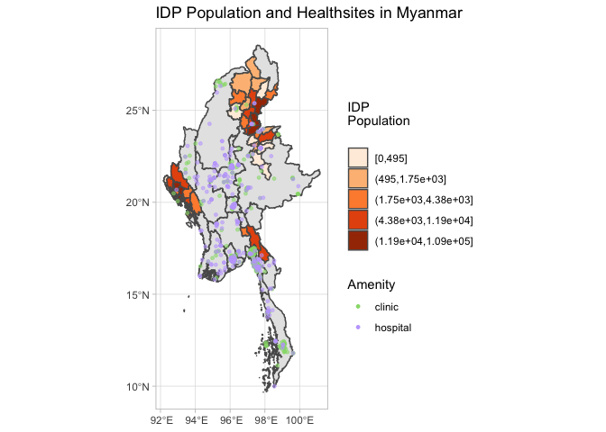

Support Myanmar’s Pro-Democracy Movement
================

## Can the world hear us?

## Support, spread the word, donate to Myanmar

Click this to find a compilation of donation links:
<http://laphetyaylinks.com>

------------------------------------------------------------------------

------------------------------------------------------------------------

## Displaced Populations in Myanmar due to the Myanmar military’s human rights violations

This map shows displaced populations in Myanmar before Feb 1st’s coup.
Now, the statistics are higher than that, and will only grow worse until
the Myanmar military and its violence that has lasted for over 70 years
is ended once and for all.

<!-- -->
